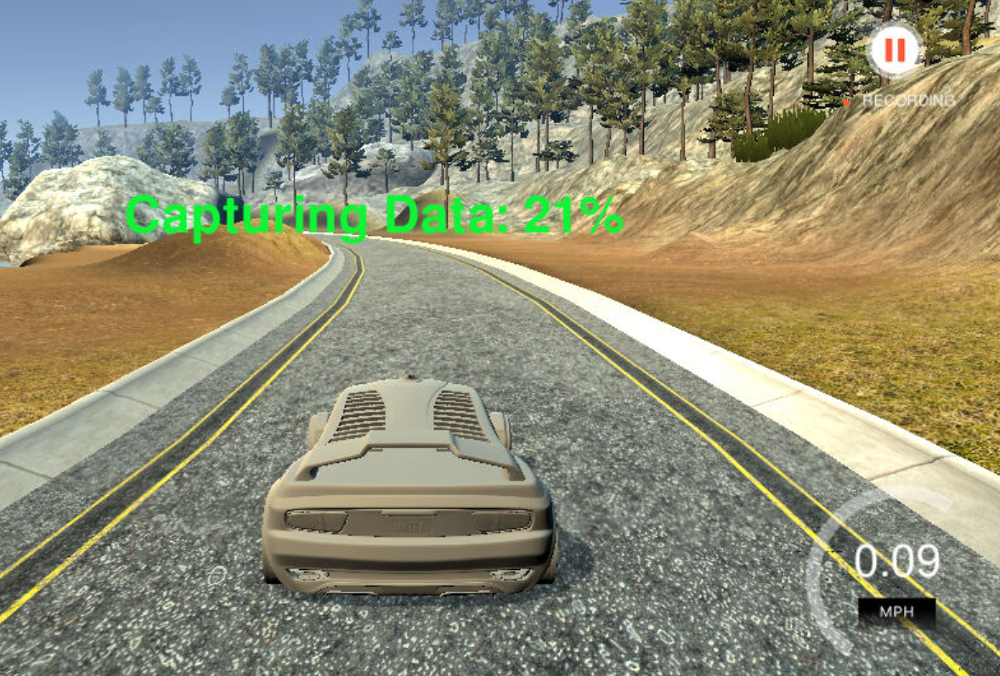
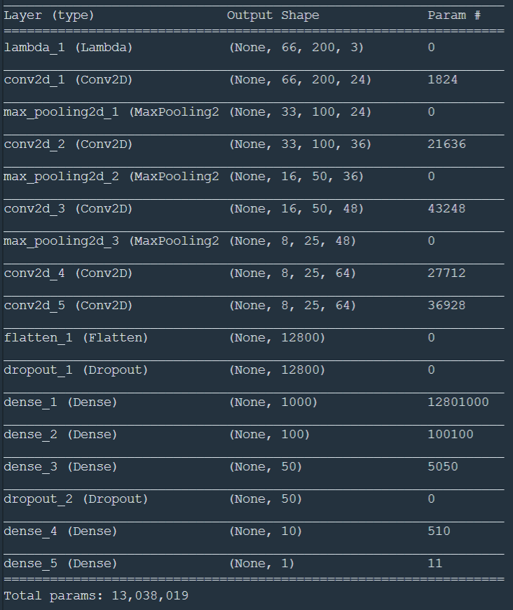

# Behavioral Cloning

## Objective 

This tries to let a driving agent learn how to drive by seeing human's drive records. 

## Approach

- Record manually drived virtual vehicle
    - Used a driving course environment on Unity
    
    - drived a virtual car, and recorded followings:
        -  images of from the vehicle from 3 points 
            -  front(center)
            -  front(biased-to-left)
            -  front(biased-toright))
        -  sterring input by human
- Trained CNN model 
    - Used the images as the input and the steering movement as the output
    - Recorded 2 laps of a same environement (once in forward, once in backward cycle)
    - Used following CNN network. This is based on (but modified) NVIDA's network for self-driving car  (https://devblogs.nvidia.com/deep-learning-self-driving-cars/)

    

    - Data is preprrocessed/augumated as below:
        - Cropped the top and bottom of the images and focused on the area where the road is shown
        - Resized to (200 x 66) 
        - normalized the data between -0.5 - +0.5 
        - add left-right flipped images (+ flipped sterring)
        - adjusted the right camera image's corresponding steering as -0.2 (toward left) and the left camera's images as +0.2 (toward right) 
        - changed to HLS color space and randomly adjusted the brightness (to avoide the impact of shadow) 
        - Blurred using gaussian blurring by 5x5 matrix 
    
## Result 

- The car can run one wrap in the same course 
- See the video above (mp4 file is <a href="./run1.mp4">here</a>)

## Limiation and improvement opportunities
- This depends on images and does not understand where is the roads. Therefore, when the car faces unseen scenary (ex.out of the road), the car losts control. This can be solved by adding the concept of localization.  
- Currently, the output is only limited to sterring and the slottle value is fixed. By adding slottle motions as the output, the drive will be more natural, thought more training will be required

## How to Run 

- training the model 'python train.py'
- run the model 'python drive.py model.h5'
- run Unity simulator (the environment is on Udacity server. The way to run localy is ... (TBD))